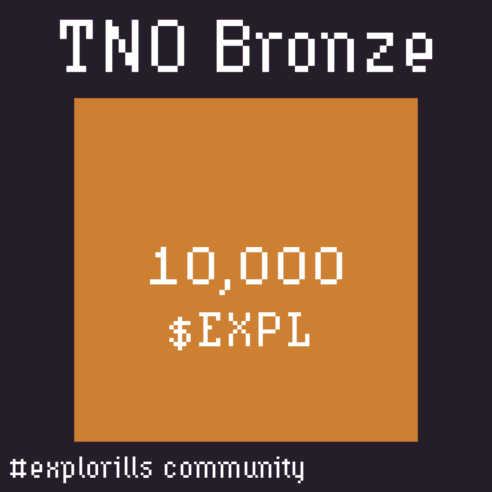
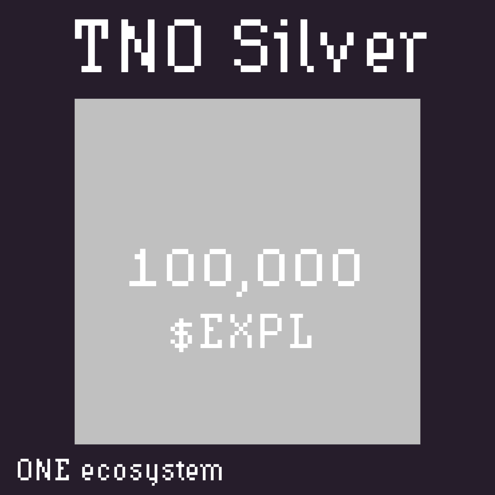
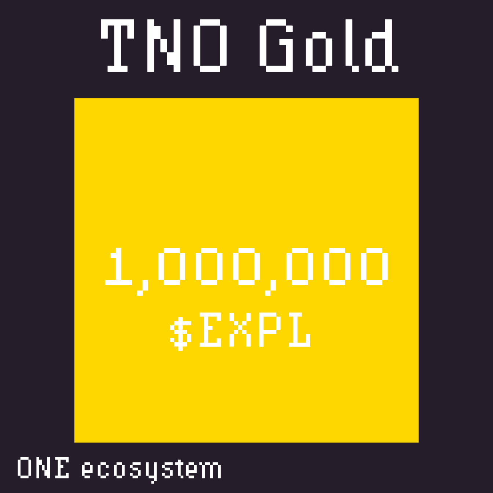
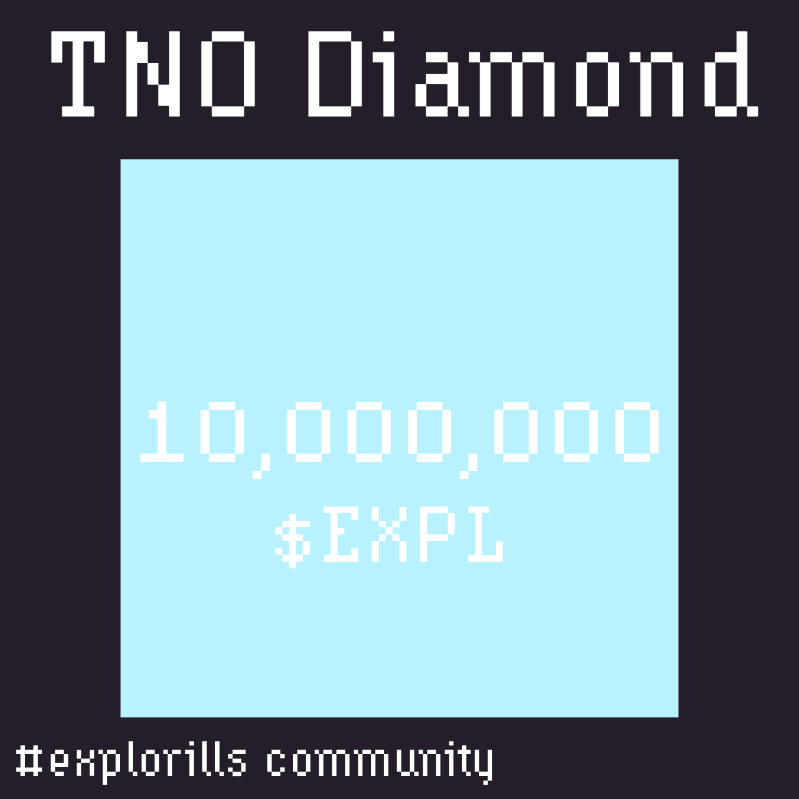

# TNO Cards Pricing

!!! danger "Archived — Program Discontinued"
    **This page is archived.** TNO Cards are no longer available for purchase. See the [Archive Overview](../overview.md) for full details on contract status and supply reallocation.

---

## Historical Pricing Table

| TNO Tier | EXPL Amount | Price (USD) | Price per EXPL | Discount vs Bronze |
|----------|-------------|-------------|----------------|---------------------|
| **Bronze** | 10,000 | $80 | $0.008 | — |
| **Silver** | 100,000 | $720 | $0.0072 | 10% |
| **Gold** | 1,000,000 | $5,760 | $0.00576 | 28% |
| **Diamond** | 10,000,000 | $40,320 | $0.00403 | 49.6% |

Higher tiers offered a lower per-EXPL cost, with up to 49.6% discount at the Diamond level.

---

## TNO Card Artwork

  <figure style="text-align: center;">
    
    <figcaption><em>Bronze</em></figcaption>
  </figure>
  <figure style="text-align: center;">
    
    <figcaption><em>Silver</em></figcaption>
  </figure>

  <figure style="text-align: center;">
    
    <figcaption><em>Gold</em></figcaption>
  </figure>
  <figure style="text-align: center;">
    
    <figcaption><em>Diamond</em></figcaption>
  </figure>

